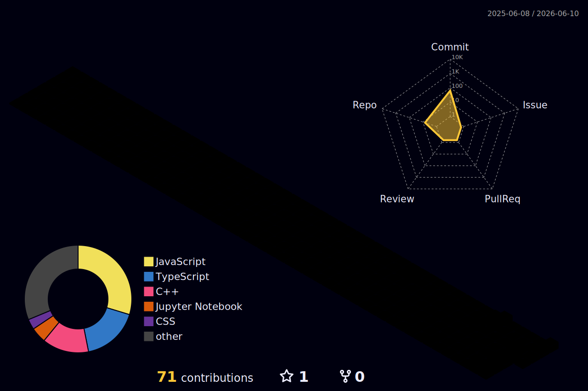

<div align="center">


</div>

<div align="center">

[](https://git.io/typing-svg)

</div>

---

<div align="center">

[](https://github.com/MOSHO1133)
[](https://github.com/MOSHO1133)
[](https://github.com/MOSHO1133)

</div>

---

## 👨‍💻 About Me

```yaml
Name        : Muhammad Shees
Handle      : MOSHO1133
Location    : Pakistan 🇵🇰
Role        : Full-Stack Developer
Focus       : Web · Mobile · Systems Programming
Languages   : Python · JavaScript · Dart · C++ · TypeScript
Frameworks  : Flutter · React · Django · Node.js
Available   : Open to collaborations & open-source contributions
```

- 🔭 Currently building **cross-platform mobile apps** with Flutter & Dart
- 🌱 Deepening expertise in **Full-Stack Web Development** and **System Design**
- 🤝 Open to collaborating on **Open-Source Projects**
- 💡 Passionate about writing **clean, efficient, and scalable code**
- ⚡ Fun fact: I debug with `print()` and I'm not ashamed

---

## 🛠️ Tech Stack

### Languages
<p>


</p>

### Frameworks & Libraries
<p>


</p>

### Databases
<p>


</p>

### Tools & Platforms
<p>


</p>

---

## 📊 GitHub Analytics

<div align="center">
  
</div>

<div align="center">
  
  
</div>

<div align="center">
  
  
  
</div>

---

## 📈 Contribution Graph

<div align="center">
  
</div>

<div align="center">
  
</div>

---

## 🗂️ Featured Projects & Repositories

### 🤖 AI & Machine Learning

<div align="center">

| # | Project | Description | Tech |
|:---:|:---|:---|:---:|
| 1 | [**Flood-Detection-Model**](https://github.com/MOSHO1133/Flood-Detection-Model) | Deep learning model for real-time flood detection and prediction |   |
| 2 | [**DoS-Sentinel**](https://github.com/MOSHO1133/DoS-Sentinel) | AI-powered Denial of Service attack detection and monitoring system |  |
| 3 | [**developershub-aiml-internship-2026**](https://github.com/MOSHO1133/developershub-aiml-internship-2026) | AI & ML internship projects and assignments — 2026 cohort |   |

</div>

### 🌐 Web & Full Stack

<div align="center">

| # | Project | Description | Tech |
|:---:|:---|:---|:---:|
| 1 | [**Zynxis**](https://github.com/MOSHO1133/Zynxis) | Full-stack web application — modern UI with robust backend architecture |  |
| 2 | [**signaliq**](https://github.com/MOSHO1133/signaliq) | Smart signal intelligence web platform with real-time data processing |  |
| 3 | [**Leads**](https://github.com/MOSHO1133/Leads) | Lead management and tracking web application |  |
| 4 | [**BookLens**](https://github.com/MOSHO1133/BookLens) | Book discovery and review platform with smart recommendations |  |
| 5 | [**weather-app**](https://github.com/MOSHO1133/weather-app-) | Real-time weather app with location-based forecasts and clean dashboard UI |  |

</div>

### 🎨 Portfolio & Personal

<div align="center">

| # | Project | Description | Tech |
|:---:|:---|:---|:---:|
| 1 | [**Shees-Portfolio**](https://github.com/MOSHO1133/Shees-Portfolio) | Personal portfolio website showcasing projects, skills and experience |   |
| 2 | [**my-portfolio**](https://github.com/MOSHO1133/my-portfolio) | Earlier portfolio version — design iterations and experiments |  |

</div>

### 📱 Mobile Development

<div align="center">

| # | Project | Description | Tech |
|:---:|:---|:---|:---:|
| 1 | [**mad_project**](https://github.com/MOSHO1133/mad_project) | Cross-platform mobile app with clean UI and smooth navigation |   |
| 2 | [**Mobile-Application**](https://github.com/MOSHO1133/Mobile-Application) | Performance-critical mobile application built with C++ |  |
| 3 | [**moble-app**](https://github.com/MOSHO1133/moble-app) | 4th semester course mobile app project |  |

</div>

### 🐍 Python & Automation

<div align="center">

| # | Project | Description | Tech |
|:---:|:---|:---|:---:|
| 1 | [**paas**](https://github.com/MOSHO1133/paas) | Python automation & scripting tool for productivity and process automation |  |

</div>

### 🎮 Systems & Simulations

<div align="center">

| # | Project | Description | Tech |
|:---:|:---|:---|:---:|
| 1 | [**TABS Harassment Band**](https://github.com/MOSHO1133/TABS--Harrasment-Band-) ⭐ | C++ simulation recreating TABS Harassment Band mechanics with OOP design and custom game logic |  |

</div>

---

## 🏆 GitHub Trophies

<div align="center">


</div>

<div align="center">


</div>

---
## 🤝 Connect With Me

<div align="center">

[](https://github.com/MOSHO1133)
[](mailto:mohammadshees2004@gmail.com)
[](https://www.linkedin.com/in/muhammad-shees17/)

</div>

---

<div align="center">

### 💬 Quote I Live By

> *"First, solve the problem. Then, write the code."*
> — John Johnson

</div>

---

<div align="center">


**⭐ If you find my work useful, consider starring some repos!**

</div>
